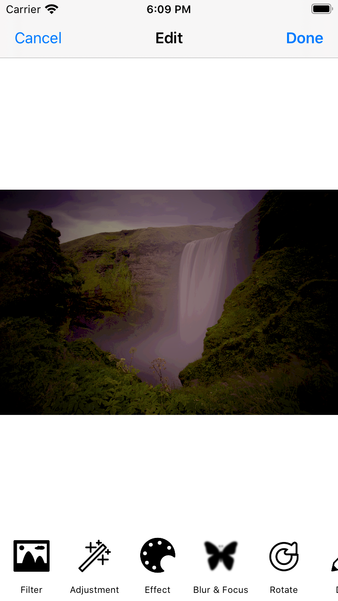
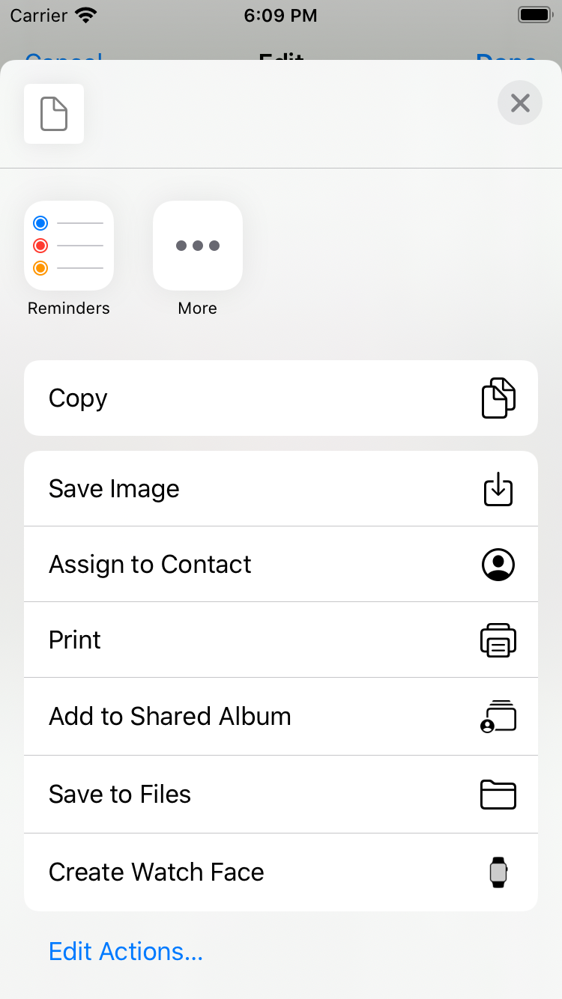

# EasyFilter
EasyFilter is a filter suggestion application. Filters are supposed according to the liked and disliked filters with the Genetic Algorithm.

  - If you have trouble with choosing a filter
  - If you waste a lot of time filtering your photos
  - If you want to filter your photos in a fun way
  - You are at the right place...
  
[CIFilter] is used for filters. 8 filters are used in the genetic algorithm. 
These: 
- CIGammaAdjust
- CIExposureAdjust
- CIHueAdjust
- CIVibrance
- CIColorPosterize
- CISepiaTone
- CIVignette
- CISharpenLuminance

The values given to the filters constitute our DNA in Genetic Algorithm. Single input filters have been chosen for their workableness. The quality of the filtered photos on the filter selection screen has been reduced in terms of application optimization. Saved and shared photos are the same size.
## Usage

  - Photo can be selected from camera or album
  - Swipe the photos you 🥰 to the →, swipe the ones you 😕 to the ←
  - Swipe ⬆ photos you 😍
  - After selecting a photo, you can set small details on the detail screen
  - You can save the photo and share it on social media applications

## Screenshots

Home Interface                  |   Choose Filter
:------------------------------:|:------------------------------:
|  

Edit Filter                  |  Save or Share Photo
:---------------------------:|:---------------------------:
|  

### Libraries

EasyFilter uses a number of open source projects to work properly:

* [Shuffle] - A card swiping library for Swift
* [CLImageEditor] - Basic image editing features to iPhone apps

And of course EasyFilter itself is open source with a [public repository][dill]
 on GitHub.

### Todos
 - Dark Mode to Edit Screen
 - More Filters to Genetic Algorithm

**Free Software, Hell Yeah!**

[//]: # (These are reference links used in the body of this note and get stripped out when the markdown processor does its job. There is no need to format nicely because it shouldn't be seen. Thanks SO - http://stackoverflow.com/questions/4823468/store-comments-in-markdown-syntax)

   [dill]: <https://github.com/chillxcode/BLM4510-EasyFilter>
   [Shuffle]: <https://github.com/mac-gallagher/Shuffle>
   [CLImageEditor]: <https://github.com/yackle/CLImageEditor>
   [CIFilter]: <https://developer.apple.com/library/archive/documentation/GraphicsImaging/Conceptual/CoreImaging/ci_intro/ci_intro.html#//apple_ref/doc/uid/TP30001185>
   [git-repo-url]: <https://github.com/joemccann/dillinger.git>
   [john gruber]: <http://daringfireball.net>
   [df1]: <http://daringfireball.net/projects/markdown/>
   [markdown-it]: <https://github.com/markdown-it/markdown-it>
   [Ace Editor]: <http://ace.ajax.org>
   [node.js]: <http://nodejs.org>
   [Twitter Bootstrap]: <http://twitter.github.com/bootstrap/>
   [jQuery]: <http://jquery.com>
   [@tjholowaychuk]: <http://twitter.com/tjholowaychuk>
   [express]: <http://expressjs.com>
   [AngularJS]: <http://angularjs.org>
   [Gulp]: <http://gulpjs.com>
